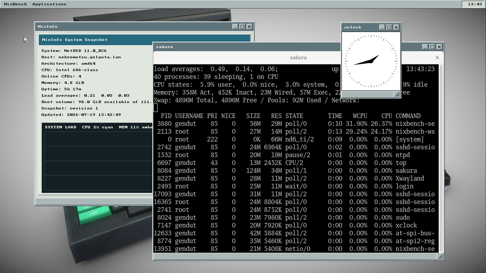
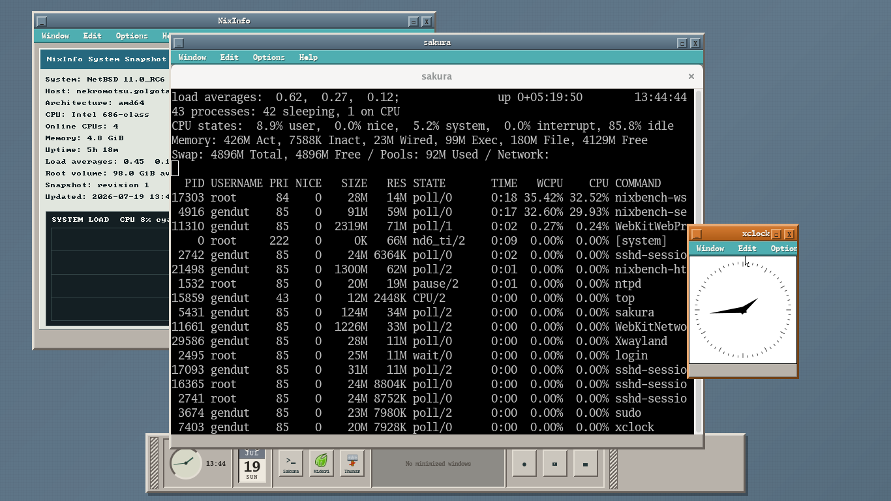
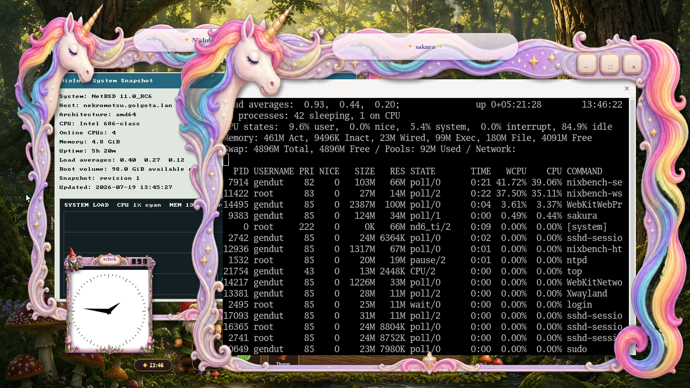
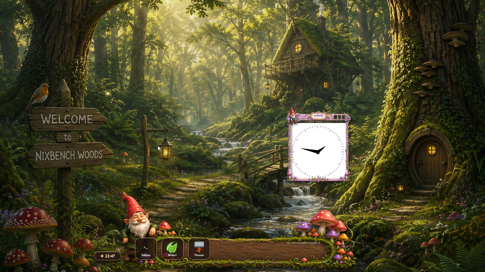

# NixBench

NixBench is an experimental desktop environment for NetBSD, written in C and
built around SDL3, an internal window manager, and an embedded Wayland
compositor. It runs directly on the NetBSD console, manages native Wayland,
GTK3, SDL3, and rootless X11 applications, and can render its desktop chrome
from HTML and CSS theme bundles.

Its interaction model and original visual direction draw inspiration from
Workbench-like systems and classic Unix desktops. The native Classic theme,
a CDE-inspired desktop, and a responsive Fantasy theme have all been exercised
on real NetBSD hardware.

## Screenshots

### Classic



*The native Classic desktop with NixInfo, GTK3/Wayland Sakura, and X11 xclock
through rootless Xwayland.*

### CDE



*The HTML/CSS-rendered CDE theme supplies beveled application frames, a
desktop menu, launchers, an analog clock, and minimized-window slots in its
bottom front panel.*

### Fantasy



*The Fantasy theme uses full unicorn frames for normal application windows and
a compact gnome-and-mushroom frame for small utilities such as xclock.*



*The Fantasy desktop combines its responsive HTML/CSS decorations with an
enchanted dock and the NixBench Woods backdrop.*

### Application compatibility


*The SDL3-based 1984 Amstrad CPC emulator running through Wayland on NixBench,
alongside NixInfo and a Sakura terminal.*

## What works today

- Hosted development inside an SDL3 window and standalone operation through
  NetBSD `wsdisplay` and wscons.
- A Workbench-style global menu bar supplied by the focused application.
- Movable, resizable, minimizable, and maximizable managed windows.
- Native NixBench applications including NixInfo and NixClock.
- GTK3/Wayland applications such as Sakura and Midori, with an optional bridge
  that publishes their menus in the NixBench bar.
- Rootless Xwayland compatibility for traditional X11 applications,
  including keyboard focus, EWMH fullscreen requests, and bounded direct or
  `INCR` text clipboard interoperability with Wayland applications.
- HTML/CSS desktop themes rendered into authenticated compositor atlases,
  with atomic frame updates and immediate native-Classic fallback if the
  renderer fails or disconnects.
- Hardware-validated Classic, CDE, and Fantasy desktops. Fantasy selects a
  compact decoration for small utility windows rather than shrinking its full
  unicorn frame.
- Persistent application pins, window-control preferences, configurable solid
  or gradient backdrops, and PNG wallpaper placement in `~/.nixbenchrc`.
- Delayed PNG screenshots and live CPU/memory history in NixInfo.
- Privilege separation between the ordinary-user desktop and the small
  root-owned console/device helper.
- A 72-test non-destructive suite covering the desktop model, renderers,
  Wayland protocols, X11 transfer support, session supervision, and recovery.

NixBench is still experimental. Its protocol extensions and internal APIs are
not stable, and the standalone path is not yet presented as a production login
session.

## Goals

- Make NetBSD a first-class development and runtime platform.
- Run standalone by owning display and input devices directly.
- Provide a responsive, coherent Workbench-inspired desktop.
- Run native applications as independent processes and windows.
- Make existing Unix GUI software useful through Wayland and X11 compatibility.
- Keep the core small, understandable, and portable where that does not
  compromise the NetBSD experience.

## Quick start

For a normal source build:

```sh
cmake -S . -B build -DCMAKE_BUILD_TYPE=Debug
cmake --build build
ctest --test-dir build --output-on-failure
./build/nixbench
```

An installed NetBSD standalone session is started from a physical console with:

```sh
nixbench-session --local
```

Select a validated desktop for one session with:

```sh
NIXBENCH_HTML_THEME=classic nixbench-session --local
NIXBENCH_HTML_THEME=cde nixbench-session --local
NIXBENCH_HTML_THEME=fantasy nixbench-session --local
```

The standalone session owns the console, so read the recovery and installation
instructions before the first hardware run.

## Documentation

- [Architecture](docs/architecture.md) — hosted development, application
  compatibility, and the standalone target.
- [HTML desktop themes](docs/html-themes.md) — the Option-2 browser-rendered
  decoration architecture, theme bundles, safety boundary, and milestones.
- [Project status and hardware validation](docs/project-status.md) — current
  implementation details and recorded NetBSD test results.
- [Building and hosted development](docs/building.md) — dependencies, CMake
  options, backend probing, and running the desktop in a development window.
- [ARM64 Xwayland build notes](docs/arm64-xwayland.md) — binary dependency
  shortcuts, thermal-safe pkgsrc builds, and the current NetBSD 10.1 protocol
  header/buildlink blocker.
- [Privilege-separated standalone session](docs/standalone-session.md) —
  installation, configuration, application probes, recovery gates, and
  physical validation.
- [Framebuffer research harness](docs/framebuffer-harness.md) — the older
  root-only `wsdisplay`/wscons experiment and its safety procedures.
- [Standalone backend design](docs/standalone-backend.md) — staged output and
  input backend architecture.
- [Privilege-boundary assessment](docs/privilege-boundary.md) — device
  authority, recovery, and process-separation design.
- [Development plan](PLAN.md) — milestones, deliverables, and exit criteria.

## Contributing

The interfaces and source layout have not stabilized. Early contributions
should begin with discussion of the relevant roadmap milestone and preserve
the NetBSD-first, lightweight design goals.

Project artwork, names, and interface elements must be original or distributed
under compatible terms. Workbench and AROS are inspirations, not sources of
assets or branding.

## License

NixBench is distributed under the [BSD 2-Clause License](LICENSE).
